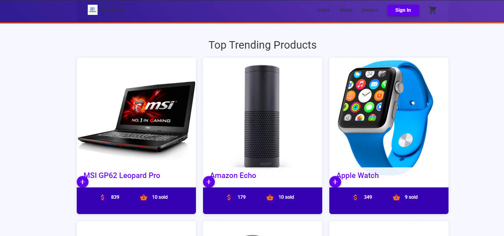
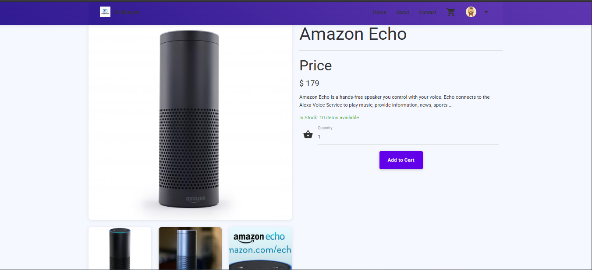
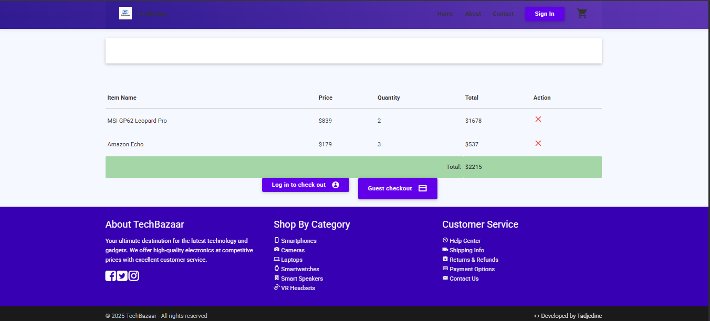
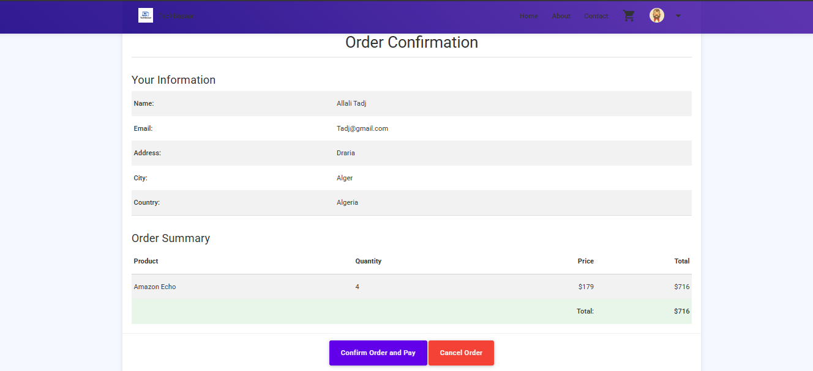

# TechBazaar - E-commerce Platform


## Overview
TechBazaar is a full-featured e-commerce platform built with PHP and MySQL, designed to provide a seamless shopping experience for tech products and electronics. The platform includes both user and admin interfaces, with features like product browsing, shopping cart management, secure checkout, and order tracking.

## Features

### Customer Features
- 🔍 Advanced product search functionality
- 🛍️ Shopping cart management
- 👤 User authentication and profile management
- 💳 Secure checkout process
- 📦 Order tracking and history
- 🎯 Guest checkout option
- 📱 Responsive design for all devices

### Admin Features
- 📊 Dashboard with sales analytics
- 📦 Product management (add, edit, delete)
- 👥 User management
- 📝 Order management
- 📈 Sales reports
- 🏷️ Category management

## Technology Stack
- **Backend**: PHP
- **Database**: MySQL
- **Frontend**: HTML5, CSS3, JavaScript
- **Framework**: Materialize CSS
- **Additional Libraries**: 
  - jQuery
  - Material Icons
  - Animate.css

## Screenshots

### Homepage


### Product Listing


### Shopping Cart


### Checkout Process


## Installation

1. Clone the repository:
```bash
git clone https://github.com/yourusername/techbazaar.git
```

2. Set up your local environment:
   - Install XAMPP/WAMP/MAMP
   - Place the project in your web server's root directory
   - Import the database schema from `ecommerce.sql`

3. Configure the database connection:
   - Open `db.php`
   - Update the database credentials:
   ```php
   $connection = mysqli_connect('localhost', 'your_username', 'your_password', 'ecommerce_db');
   ```

4. Run the database triggers installation:
   - Execute `install_triggers.php` to set up necessary database triggers

5. Access the website:
   - Open your browser and navigate to `http://localhost/techbazaar`

## Database Structure
The project uses a MySQL database with the following main tables:
- Users
- Products
- Categories
- Orders
- Order Details
- Cart

## Security Features
- Password hashing
- SQL injection prevention
- XSS protection
- CSRF protection
- Secure session management
